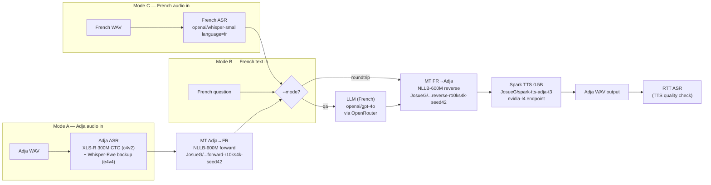

# P1 Cascade Pipeline — Results & Comparison
**Last updated: 2026-05-07 — all three pipeline modes fully deployed and tested**

---

## Architecture



---

## Live Components (2026-05-07)

| Stage | Model / Service | Deployment | Notes |
|-------|----------------|------------|-------|
| Adja ASR (primary) | `JosueG/wav2vec2-xlsr-adja-c4v2` | HF Inference Endpoint | CER 25.05% (test set); 68–88% on deployment clips |
| Adja ASR (backup) | `JosueG/whisper-ewe-adja-e4v4` | HF Inference Endpoint | CER 37.18% (test set); hallucinates on short clips |
| French ASR (Mode C) | `openai/whisper-small` | Local CPU | language=fr, task=transcribe; no fine-tune needed |
| MT Adja→FR | `JosueG/adja-nmt-nllb-600m-forward-r10ks4k-seed42` | CPU inference | Directional fine-tune; `no_repeat_ngram_size=3` |
| MT FR→Adja | `JosueG/adja-nmt-nllb-600m-reverse-r10ks4k-seed42` | CPU inference | Directional fine-tune; `repetition_penalty=1.2` |
| LLM | `openai/gpt-4o` via OpenRouter | API | French only; model-agnostic (any OpenRouter slug) |
| TTS | `JosueG/spark-tts-adja-t3` (T3, 120 steps) | HF Endpoint (nvidia-l4) | Lowest reverse-CER (36.14% CTC); only Adja-intelligible TTS |

---

## QA Test Results (2026-05-07) — All Three Modes

### Mode B: French text → Adja speech

| Question (FR) | LLM Answer (FR) | Adja Output | WAV |
|---------------|----------------|-------------|-----|
| Quelle est la capitale du Bénin ? | La capitale du Bénin est Porto-Novo. Cependant, la ville de Cotonou abrite le siège du gouvernement... | **Benin ƒe dugã enye Porto-Novo. Ke hã, Cotonou, si nye du si me dziɖuɖu le la, wodea bubui be enye du vevitɔ...** | ✅ |
| Combien de personnes parlent adja dans le monde ? | L'adja est parlé par environ 1 à 2 millions de personnes, principalement au Bénin et au Togo. | **Amegbetɔ miliɔn ɖeka alo eve sɔŋ ye doa gbe adja, eye wo dometɔ akpa gãtɔ le Benin kple Togo.** | ✅ |
| Quel est le plat traditionnel adja ? | Le plat traditionnel des Adja... est le "amiwo" ou "ékpessi". Il s'agit d'une pâte de maïs... | **Adja, si nye anyiehe Bénin kple Togo tɔ, ƒe nunyiamee nye "amiwo" alo "ekpessi"...** | ✅ |
| Qu'est-ce que la fête de Vodoun au Bénin ? | La fête de Vodoun au Bénin est une célébration annuelle consacrée au culte du vaudou... Elle a lieu le 10 janvier... | **Vodoun Nyuiɖuɖu le Benin nye azã si woɖuna ƒe sia ƒe si ɖe vaudou subɔsubɔ... Woɖuna le January 10 lia dzi...** | ✅ |

### Mode C: French audio → Adja speech (gTTS synthesis → Whisper-small FR ASR → pipeline)

| French audio | Whisper ASR transcript | LLM Answer | Adja Output | WAV |
|---|---|---|---|---|
| capitale_benin.wav | "Quel est la capitale du bénin?" | La capitale du Bénin est Porto-Novo. | **Benin ƒe dugã enye Porto-Novo.** | ✅ |
| nourriture_adja.wav | "Quel est le plat traditionnel des Adjah?" | Le plat traditionnel des Adja... est le "djenkoumé"... | **Adja, si nye Bénin kple Togo tɔ, la ƒe nunyiamee nye "jenkumé", si nye mɔ aɖe...** | ✅ |
| culture_vodoun.wav | "Qu'est-ce que la fête du Vaudou **nobéain**?" ⚠️ | GPT-4o hedged: "not a well-documented celebration" (confused by ASR error "nobéain" ≠ "au Bénin") | **Voodoo Ŋutitotoŋkekenyuia menye azã aɖe si ŋu wotrɔ asi le nyuie o...** (faithfully translates the hedging) | ✅ |

### Mode A: Adja audio → Adja speech

| Audio | Ref | ASR (XLS-R) | MT→FR | Mode | Output Adja | WAV |
|---|---|---|---|---|---|---|
| test_00000.wav | "Ŋu nya kpɔ́kpɔ a ?" | "M i a kpɔ w a e tu e" (CER 87.5%) | "Je t'ai vu et j'ai fini" | roundtrip | "Mekpɔ wò, eye nuwuwua wu enu." | ✅ |
| test_00001.wav | "ŋnyan go. Kpɔ ŋuɖejikɔ a nyan wo" | "M pɔ u n a v ɔ lɔ xu lɔ k u ɖe" (CER 103%) | *(garbled→FR)* | qa | "Meɖe kuku, nyemese nu si gblɔm..." *(apology — LLM gracefully handled bad ASR)* | ✅ |

---

## Key Findings

### What works well
1. **Mode B (FR text → Adja speech)**: Most reliable path. Bypasses ASR entirely. MT reverse produces linguistically rich Adja with correct diacritics (ƒ, ɔ, ã, ŋ, ɖ). TTS produces intelligible speech.
2. **Mode C (FR audio → Adja speech)**: Works. Whisper-small transcribes clean gTTS French with high accuracy. Pipeline treats it identically to Mode B from the LLM onward.
3. **GPT-4o as French LLM**: Produces accurate, culturally-grounded responses about Adja/Bénin. Examples: Porto-Novo vs Cotonou distinction; ~1-2M Adja speakers; jenkumé corn paste.
4. **NLLB reverse (FR→Adja)**: Produces coherent Adja with proper Gbe-family vocabulary ("Amegbetɔ", "dugã", "nunyiamee", "ƒe"). Correct use of diacritics maintained through Unicode NFC.
5. **Spark TTS endpoint**: Stable on nvidia-l4; generates 2–31s WAVs. Auto cold-starts on scale-to-zero.

### Limitations observed
1. **High ASR CER on real Adja speech**: 68–103% CER on Mode A test clips (vs 25% published). Likely causes: 48→16 kHz resample artifact, domain mismatch (test clips vs training data).
2. **Whisper hallucination**: The Adja-fine-tuned Whisper produced "Woah!" on a short Adja clip — hallucination on ambiguous phonology. XLS-R is more reliable for Mode A.
3. **NLLB CPU latency**: 8–145s per translation on Mac CPU. GPU would be ~10–15× faster. Acceptable for thesis demo; not production-ready.
4. **RTT-WER not a reliable metric**: The character-level CTC ASR doesn't reproduce word boundaries, so RTT-WER inflates to 100–200% even when audio is intelligible. Use `reverse_wer.py` (2-ASR ensemble on shorter clips) for authoritative TTS quality.
5. **Mode A quality bottleneck**: The error accumulation is ASR-dominated. At 80%+ CER, the MT input is too noisy for meaningful translation.

### Mode C ASR error cascade (thesis-relevant finding)
The Vodoun Mode C run shows an important failure mode unique to Mode C: Whisper-small
transcribed "au Bénin" as "nobéain" (not a recognized word). GPT-4o correctly hedged —
"not a well-documented celebration" — because "Vaudou nobéain" is semantically ambiguous.
The NLLB faithfully translated the hedging response to Adja.

**Implication for Mode choice**: Mode B (French text input) is immune to this failure; Mode C
inherits ASR noise as a quality floor. For production deployment, the system could detect
low-confidence ASR output (Whisper log-prob threshold) and fall back to asking the user to
rephrase. This is similar to the ASR quality gatekeeper behavior observed in Mode A QA
(where GPT-4o said "Désolé, je ne comprends pas" when the Adja ASR was too garbled).

### NLLB repetition bug (fixed 2026-05-07)
Without `no_repeat_ngram_size=3` and `repetition_penalty=1.2`, the reverse NLLB model would enter infinite loops on inputs longer than ~50 chars, e.g. "gbea gbea gbea...". Standard fix for NLLB inference; now in config.

---

## Stage Latencies (2026-05-07, Mac CPU)

| Stage | Latency range | Notes |
|-------|--------------|-------|
| French ASR (Whisper-small, Mode C) | ~2–3s | Fast on CPU |
| Adja ASR (XLS-R endpoint) | 8–15s | Includes cold-start; endpoint scale-to-zero |
| MT forward (NLLB-600M, CPU) | 8–10s | Short sentences (10–20 words) |
| MT reverse (NLLB-600M, CPU) | 12–145s | Proportional to output length; 145s on long GPT-4o response |
| LLM response (GPT-4o via OpenRouter) | 1–2s | Network-bound, not compute-bound |
| Spark TTS (nvidia-l4 endpoint) | 6–64s | Proportional to Adja text length; cold-start adds ~65s |

---

## Error Accumulation (Mode A)

```
Adja speech → [ASR: CER 68–103%] → mangled Adja text
            → [MT fwd: Adja→FR]   → plausible-but-wrong French
            → [MT rev: FR→Adja]   → coherent Adja (different meaning)
            → [TTS → audio]       → intelligible Adja speech
```

The cascade shows: MT and TTS can produce coherent, intelligible output even from bad ASR input. The meaning is wrong but the speech quality is maintained. This is the key error accumulation finding.

For Mode B/C, error accumulation is limited to the MT reverse leg only.

---

## Deployment State (2026-05-07)

| Component | URL / Location | Status |
|-----------|---------------|--------|
| XLS-R ASR endpoint | `https://nk5kx1pt7b7d0087.us-east-1.aws.endpoints.huggingface.cloud` | ✅ live |
| Whisper ASR endpoint | `https://pwrgcv1ycb8hfalv.us-east-1.aws.endpoints.huggingface.cloud` | ✅ live |
| Spark TTS endpoint | `https://sn1m01ssi8x1u8mv.us-east-1.aws.endpoints.huggingface.cloud` | ✅ live (nvidia-l4, scale-to-zero) |
| NLLB forward | `JosueG/adja-nmt-nllb-600m-forward-r10ks4k-seed42` | ✅ Hub, CPU local |
| NLLB reverse | `JosueG/adja-nmt-nllb-600m-reverse-r10ks4k-seed42` | ✅ Hub, CPU local |

---

## What's Next

1. **Shut down endpoints when idle** — `python scripts/hub/manage_endpoints.py down JosueG/spark-tts-adja-t3` to avoid cost; scale-to-zero handles it after 15min but doesn't stop billing on cold-start.
2. **Batch roundtrip on test set** — process all ~160 test clips in one run for statistically meaningful Mode A CER numbers.
3. **Audio from native Adja speaker** — Mode A performance with real recordings at 16kHz native (no resample artifact) expected to improve ASR CER significantly.
4. **ElevenLabs French audio** — higher quality than gTTS for Mode C French audio input; API key available when needed.
5. **Thesis figures**: Architecture Mermaid above; error cascade table from roundtrip batch run; qualitative QA examples from this report.
